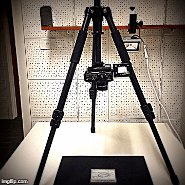
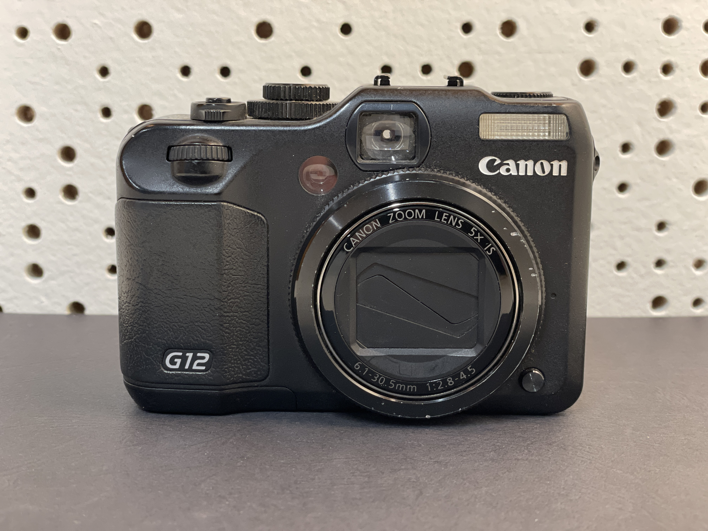
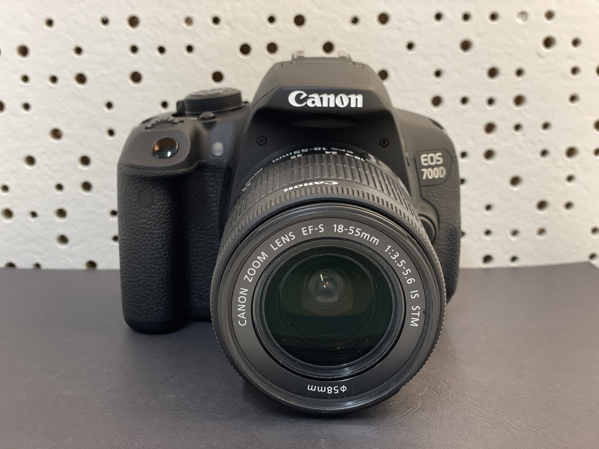

# Image Capture and Post-production Editing Workflows for PARADISEC Archive

  

This page outlines PARADISEC's approach to digitising text materials. The majority of our fieldnotes, papers, and notebook digitisation is done with high resolution photography, not scanning. Here are some reasons why we choose to use photography rather than scanning:

* the process is much faster
* items that are very fragile or have different shapes are easily accomodated with less handling
* this method will capture very high quality images with correct colour representation
* the equipment is portable and can easily be set up in most environments, including remote field locations with tricky power options
* depending on your equipment choices, this can be the least expensive option, yet will still retain high quality output

## Equipment used in this guide

| Equipment | Description and links to more details |
| :----- | :----- |
| Cameras | [Canon Powershot G12](https://id.canon/en/support/6200087900/1?model=4342B) *(compact digital camera)* and [Canon EOS Rebel T5i 700D](https://www.canon.ie/for_home/product_finder/cameras/digital_slr/eos_700d/specification.html) *(DSLR)* |
| Photo stand | [Kaiser Reprokid](http://www.kaiser-fototechnik.de/en/produkte/2_1_produktanzeige.asp?nr=5360) | 
| Tripod with Reversable centre post | [Velbon Sherpa 200R Pro Tripod](https://velbon.net/product/sherpa/sherpa-200r.html) |
| Shelf clamp | [Velbon Clamp Kit II](https://velbon.net/product/accessories/clampk.html) |
| Software for remote capture | [EOS Utility](https://www.canon.com.au/cameras/eos-700d/support) *(for compatible Canon cameras)* |
| Software for post-production editing | [Adobe Bridge](https://www.adobe.com/au/products/bridge.html) |

> **NOTE:** The above information and the workflow included on this page are provided as suggestions based on PARADISEC-specific workflows; feel free to choose your own hardware and software. 

### Cameras
#### Canon PowerShot G12
We purchased this Canon camera in 2010 and it is still fully functional in 2021. It is a compact digital camera, not a DSLR. This camera allows you to capture RAW images without JPEG compression, as well as JPEGs, or both simultaneously. This model does not allow for tethering without some [hacking](https://chdk.fandom.com/wiki/CHDK_1.4.0_User_Manual) of the firmware. I have not done this hack; I have developed a very functional workflow for image capture without remote capture. Another nice feature of this camera is the articulated LCD screen. You can rotate it so that your image is visible from a seated position when the camera lens is pointed downwards.

  

#### Canon Rebel Ti 700D
This DSLR *does* allow remote capture tethering. This opens up the possibility of attaching the camera to a computer to view, focus, and capture images and store them directly on your computer, with a predertrmined file-naming pattern. But you can also use the same workflow as the non-tethering compact digital camera if you do not have a computer handy at the time of digitising. This model also features an articulated LCD monitor for comfortable image viewing. Another bonus with this camera is that you can do quick zoom adjustments by manually altering the lens, which you cannot do with the PowerShot.
> **Note:** If you are going to be taking photos in a remote area with unpredictable access to a power source, you may need to pair a [portable solar pannel and power bank](https://powertraveller.com/collections/power-packs) with a [universal battery charger](https://www.digitalcameraworld.com/au/buying-guides/the-best-universal-charger-for-your-camera-batteries) to charge your camera's battery

  

### Tripods and photo stands
#### Velbon Sherpa 200R Pro
We purchased this tripod about ten years ago, so you will likely not find the exact model. But the important features on this tripod are the following:
* reversable centre post (necessary for this workflow)
* relatively compact and lightweight
* spirit level (not necessary, but nice to have)
This tripod came with the shelf clamp accessory, but you can purchase this separately. If you do, make sure there is a tripod post that come with the clamp if you do not already have a tripod with a removable centre post.

#### Kaiser Reprokid Photo Stand

## Setting up the equipment

### Using a tripod with reversable centre post

#### Equipment

#### Lighting

### Using a tripod's shelf clamp

#### Equipment

#### Lighting

### Using a photo stand

#### Equipment

#### Lighting

## Setting up the software

### Remote capture: EOS Utility (if using compatible Canon camera)

### Image preview and processing: Adobe Bridge

## Workflow for remote capture

## Workflow for non-tethered camera

## Post-production processing of images

## Additional resources
Butterworth, J., Pearson, A., Sutherland, P. & Farquhar, A. (2018) [Remote Capture: Digitising Documentary Heritage in Challenging Locations](https://www.openbookpublishers.com/product/747) Open Book Publishers, Open Field Guides Series, vol. I doi:10.11647/OBP.0138
