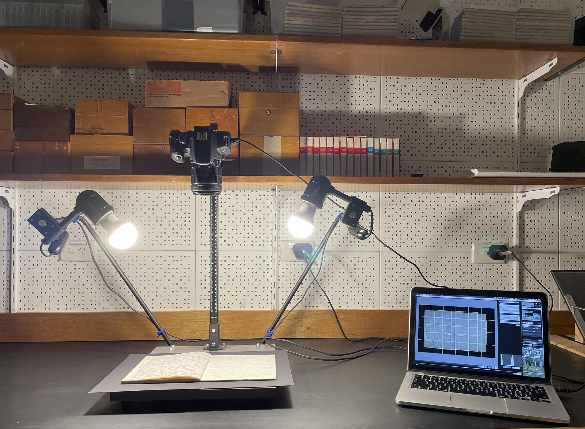
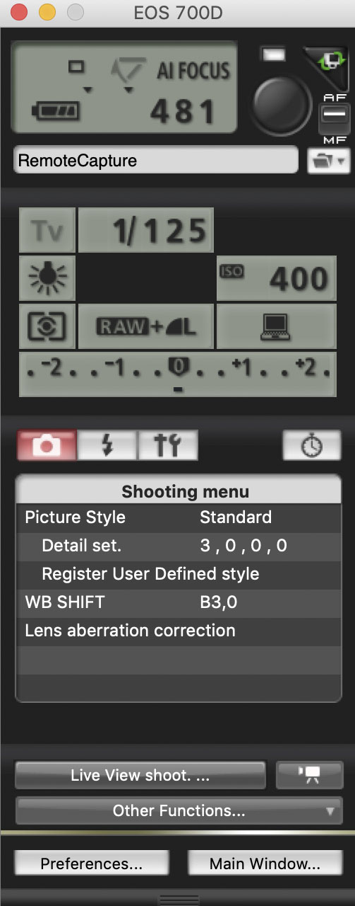
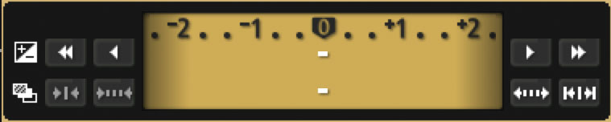

# Image Capture and Post-production Editing Workflows for PARADISEC Archive

  

This page outlines PARADISEC's approach to digitising text materials. The majority of our fieldnotes, papers, and notebook digitisation is done with high resolution photography, not scanning. Here are some reasons why we choose to use photography rather than scanning:

* the process is much faster
* items that are very fragile or have different shapes are easily accomodated with less handling
* this method will capture very high quality images with correct colour representation
* the equipment is portable and can easily be set up in most environments, including remote field locations with tricky power options
* depending on your equipment choices, this can be the least expensive option, yet will still retain high quality output

## Page Contents
* [Target format of images to be archived in PARADISEC](#target-format-of-images-to-be-archived-in-paradisec)
* [Equipment used in this guide](#equipment-used-in-this-guide)
  * [Cameras](#cameras)
  * [Tripods and photo stands](#tripods-and-photo-stands)
* [Software](#software)
  * [EOS Utility](#eos-utility)
  * [Adobe Bridge](#adobe-bridge)
* [Workflow for remote capture](#workflow-for-remote-capture)
* [Workflow for non-tethered camera](#Workflow-for-non-tethered-camera)
* [Post-production processing of images](#post-production-processing-of-images)

### Target format of images to be archived in PARADISEC
Before discussing the details of equipment we use in this workflow, here are the target file formats for image capture and archiving and the quality standards we request. Adhering to these high standards may be difficult in some situations; please try to aim for these as best you can.

|           | Capture file format | Archival copy  | Access copy  |
| :---      | :---                | :---           | :---         |
| File type |  .CR2 (RAW) | .tif     | .jpg  |
| DPI       |  72                 |  400           | 300          |
| Bits/Channel | 16 bit           | 8 bit          | 8 bit        |
| Colour mode | RGB (Adobe RGB (1998) | RGB       | RGB           |

> **Note:** The above 72 DPI *(dots per inch)* figure for the raw image is not very revealing as to the image quality compared to the 400 or 300 DPI figures. Image quality actually has more to do with pixel dimension. If you wish to read up on why DPI can be a tricky standard, take a look at this article: [The myth of DPI](http://www.rideau-info.com/photos/mythdpi.html). There will be more about target image sizes (pixel dimension) below in the section on workflow and remote capture settings.

In the end, we would only need the **.tif** version from you for the archive. Our system automatically creates the access **.jpg**. If you are archiving images of notes or a field journal, it is a good idea to also provide a single **.pdf** of the images digitally bound together. For this, you should use compressed .jpgs rather than .tifs, which will keep the size of the .pdf manageable.

----------

### Equipment used in this guide

| Equipment | Description and links to more details |
| :----- | :----- |
| Cameras | [Canon Powershot G12](https://id.canon/en/support/6200087900/1?model=4342B) *(compact digital camera)* and [Canon EOS 700D](https://www.canon.ie/for_home/product_finder/cameras/digital_slr/eos_700d/specification.html) *(DSLR)* |
| Photo stand | [Kaiser Reprokid](http://www.kaiser-fototechnik.de/en/produkte/2_1_produktanzeige.asp?nr=5360) | 
| Tripod with Reversable centre post | [Velbon Sherpa 803R Pro Tripod](https://www.ana-photo.com/Product/Velbon/VELBON-SHERPA-800R803R.html) |
| Shelf clamp | [Velbon Clamp Kit II](https://velbon.net/product/accessories/clampk.html) |
| Software for remote capture | [EOS Utility](https://www.canon.com.au/cameras/eos-700d/support) *(for compatible Canon cameras)* |
| Software for post-production editing | [Adobe Bridge](https://www.adobe.com/au/products/bridge.html) |

> **NOTE:** The above information and the workflow included on this page are provided as suggestions based on PARADISEC-specific workflows; feel free to choose your own hardware and software. 

#### Cameras

##### Canon PowerShot G12
We purchased this Canon camera in 2010 and it is still fully functional in 2021. It is a compact digital camera, not a DSLR. The PowerShot allows you to capture RAW images without JPEG compression, as well as JPEGs, or both simultaneously. This model does not allow for tethering without some [hacking](https://chdk.fandom.com/wiki/CHDK_1.4.0_User_Manual) of the firmware. I have not done this hack; I have developed a very functional workflow for image capture without remote capture. Another nice feature of this camera is the articulated LCD screen. You can rotate it so that your image is visible from a seated position when the camera lens is pointed downwards on a desk or table in front of you.

  

##### Canon EOS 700D
This DSLR *does* allow remote capture tethering. This opens up the possibility of attaching the camera to a computer to view, focus, and capture images and store them directly on your computer, with a predertermined file-naming pattern. But you can also use the same workflow as the non-tethering compact digital camera if you do not have a computer handy at the time of digitising. This model also features an articulated LCD monitor for comfortable image viewing. Another bonus with this camera is that you can do quick zoom adjustments by manually adjusting the lens, which you cannot do with the PowerShot.

  

> **Note:** If you are going to be taking photos in a remote area with unpredictable access to a power source, you may need to pair a [portable solar pannel and power bank](https://powertraveller.com/collections/power-packs) with a [universal battery charger](https://www.digitalcameraworld.com/au/buying-guides/the-best-universal-charger-for-your-camera-batteries) to charge your camera's battery

#### Tripods and photo stands

##### Velbon Sherpa 803R
We purchased this tripod about ten years ago, so you will likely not find the exact model. But the important features on this tripod are the following:
* reversable centre post (necessary for this workflow)
* relatively compact and lightweight
* spirit level (not necessary, but nice to have)

  

###### Setting up the tripod with reversable centre post
This is a great set-up beacuse it is the least expensive and the most versatile, especially if you need to photograph items in a remote location. The tricky part is getting the lighting right. Your light source (natural or artificial) could be blocked by the tripod legs and cast a shadow on your image. If your light source is in a fixed position, try moving the tripod around to minimise any shadows. You may also try to find lights that you can clip on to the legs of your tripod or onto nearby furniture. Just be mindful that too much direct, unfiltered lighting may wash out your image. I try to find a light coloured wall I can place the tripod next to and then shine the lights onto the wall. The reflected light is usually enough to provide evenly disrtributed indirecrt lighting.

  

##### Velbon shelf clamp
The Velbon tripod came with a shelf clamp accessory, but you can purchase this separately. If you do, make sure there is a tripod post that comes with the clamp if you do not already have a tripod with a removable centre post. The link in the table above directs you to a similar model to the shelf clamp that came with our Velbon Sherpa 803R.

  

###### Setting up the shelf clamp
Using just the shelf clamp and the tripod's centre post is by far the simplest combination, especially if there is any travel involved. The only drawback is that this requires a shelf that you can clamp to. However, if you are in a very remote location you could construct something with timber, bamboo, or even a smooth, sturdy branch. Just make sure it is strong and secure enough to hold your camera and allows you to create consistant images. 

Below are two configurations with the shelf clamp and an actual shelf (no need for bamboo this time). The image on the left is with the Canon EOS 700D tethered to a laptop for remote capture. The image on the right is the Canon PowerShot; images are being captured to the camera's SD card. 

  

>**Note:** Lighting can be directed toward a wall, not directly on the tape or notebook. This creates enough reflected light for the photos. When you review your images after your shoot and find that you would like them to be a bit lighter, you can batch edit the lighting using Adobe Bridge (discussed below). 

##### Kaiser Reprokid Photo Stand
The Reprokid model is a compact camera stand that can accommodate small, lightweight cameras. It works really well with either of the above Canon cameras. This photo stand came with the lighting set, so one does not need to figure out where to attach any lighting. The vertical post is ruled so you can retrieve the distance of the lens to the target, or just make note of the camera placement for quick set up the next time you shoot. The base is a hard plastic grey surface so I use black matte card stock under my items. You can place a ruler or a [colour separation guide and grey scales patch](https://www.kodak.com/en/motion/page/color-separation-guides-and-gray-scales) on the base if you need this level of size or colour precision in your image capture.

  

###### Setting up the photo stand
Photo stands have many benefits for image capture. This particular model has the lighting attached, as noted above you don't have to worry about where to clamp the lights. The light fixtures on this stand can move around, so if the light is too direct and overpowering, they can turn so that they are pointing away or toward the back wall. Be mindful of the cables from the lights; if you don't tie them up and out of the way, they can show up in an image, or cast a shadow on your subject.

Having the camera attached to a stable, ruled post is great for keeping your set-up consistant from day to day. If you need to shift things around in your space, the entire set-up can be moved as is. Having a solid base on which to put your notebooks or documents is also a fine feature. The base on this model is a bit small. If you need to build up the base to create an expanded, level for larger notebooks to fit, perhaps place some books you may have nearby around the photostand's base to create an enlarged, even platform. Or get a piece of plywood and clamp it to the photo stand base.

The downside to using a photo stand is the cost. Pricing for these can be a bit expensive. The Reprokid is one of Kaiser's less expensive models and it works very well for our purposes.

  

### Software

#### Remote capture: EOS Utility (if using a compatible Canon camera)
Remote capturing images directly to your computer can speed up your task of taking photos, especially if you set up a good workflow. There are many tethering tools available. I have chosen EOS Utility because it came with my Canon EOS 700D, it was free, and it serves our purpose. Here is an article from [Tether Tools (2020)](https://tethertools.com/blog/what-tethering-software-is-available/) that discuss other tethering software that is currently on the market.

If you are planning to use a Canon camera that is compatible with the EOS Utility software, here are the links:
* [EOS Utility for PCs](https://www.canon.com.au/support/sims-content?pid=74c2eb672e2946a7b940f86e2c9e2461&cid=3E70ECD154334FBD866C212BDC988F56&ctype=ap) 
* [EOS Utility for Macs](https://www.canon.com.au/support/sims-content?pid=0a6e29c7259d4fa8938b3bb591ebb372&cid=A5B1C6A24B9D464DBCFE41EEE51ECAD3&ctype=ap)

> **Note:** The link to the PC version is for EOS Utility 3, which is not compatible with my EOS 700D camera; however, with this installation both EOS Utility 2 and EOS Utility 3 are installed. The version that I am using is 2.14.20.0.

#### Image preview and processing: Adobe Bridge
As you capture the images, it is important to check their quality before you get too far into your task. But even at the end of the day, when if you have collected hundreds of photos, you may realise that they would be better cropped, or that the lighting was too warm and you would like to cool down the colours, you can use Adobe Bridge to do this as a batch process. Adobe Bridge is available for free. You do not need to pay for it, but you do need to sign up with Adobe. [Navigate to the Adobe Bridge download page](https://www.adobe.com/au/products/bridge.html).

> **Note:** If you are capturing raw images (.CR2 files), you cannot edit them using Bridge alone; you need to have photoshop. If you are using the EOS Utility software, a tool called Digital Photo Professional (DPP) is installed along with the remote capture tool. You can view and edit your .CR2 files and create .JPGs or .TIFs from there.

### Workflow for remote capture (Canon EOS 700D)

*(This is specifically designed for ANU-PARADISEC workflows, but the concepts are easy enough to personalise for your own purposes)*

1. Start the computer and use your ANU UniID to log on
2. Take the Canon 700D battery pack from the charger and insert into the camera.
3. Turn the camera on. This will also open the EOS Utility software installed on the computer.

>**Note:** Make sure the **AF/MF** (Auto Focus, Manual Focus) setting on the lens of the camera is set to **AF**

4. Select "camera setting/remote shooting" from the start screen. 

  

  
  A window with the camera settings will pop up on the right side of the screen.
 
 

  

  
5. Click on "Live View shoot..." as seen in the remote window above. This will open the window showing the full live view of what the camera is capturing.
6. Click on the folder icon *(found toward the top of the remote, under the AF/MF switch)* to select a destination folder. For collected items (folder, notebook, manuscript, etc.), create a new folder for each item. You will be saving these images directly to the folder you designate- *not* to the SD card in the camera.
7. To set up the file-naming for the images:
    * Click on the folder icon and select "File Names" in the preference window
    * Click "Customize..." to customize the name. Create file names that start with a collection ID, followed by a hyphen, then the item number (what you have come up with as an ID for your notebook/folder/manuscript), and then select sequential numbering of the images, e.g. DT1-04-<Sequential Number> 
    * Set "Number of Digits" to 3, This will accommodate items with 999 pages. If there are under one hundred pages, use 2 digits. If over a thousand pages, use 4 digits. This will help with the ordering in PARADISEC collections and is just good practice.
    * Set "Start" to 1 at when you begin photographing each new item (otherwise it will just continue counting from whatever was shot in the previous session)
8. Fix the position the item using the Live view window. Use the black card stok paper provided as a background and to cover the page that is not the target page.
9. Set lighting by double-clicking on the relevant icon in the settings window. The lamp symbol (indicating tungsten lighting) should show the light bulb. This is the best light setting for our studio.

  

The ISO should be 400 for our studio lighting.

  

If necessary, make finer adjustments to the image lightness/darkness by moving this digital slider either toward -1 or +1.

  

10. When the live view window shows what you would like to capture, either click on the round, black button in the top right corner in the remote window or press the space bar. A window will pop up to show the picture taken. Repeat this step for each page of your item.
11. When finishing a session for the day, wait until the last image has loaded and then switch the camera off.
12. Remove the battery and put into the charger to charge for the next session.

### Workflow for non-tethered camera (Canon PowerShot G12)

***A workflow for using using a non-tethered camera for image capture is currently in progress (03-03-2021)***

### Post-production processing of images

***A workflow for using Adobe Bridge for batch processing is currently in progress (03-03-2021)***

---

### Additional resources
Butterworth, J., Pearson, A., Sutherland, P. & Farquhar, A. (2018) [Remote Capture: Digitising Documentary Heritage in Challenging Locations](https://www.openbookpublishers.com/product/747) Open Book Publishers, Open Field Guides Series, vol. I doi:10.11647/OBP.0138
